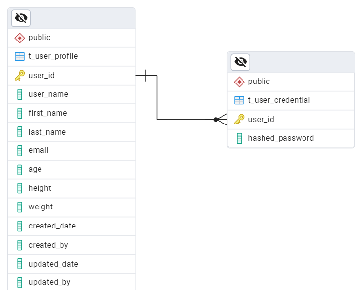

# Nurtura API
A Python API that gives user tailored nutrition recommendations using Flask

## Local Set Up

- Add a .env file based on sample-env file
- Make sure your virtual environment is activated
- Install the python dependencies using the command:  pip install -r .\requirements.txt
- Go into the app folder using command: cd app
- Start your server using the command: uvicorn main:app --port=8080
- Your server is running at: http://localhost:8080

## API Summary

### <ins>Create User Profile</ins>

**cURL Command**
```console
curl --location 'http://localhost:8080/auth/create-profile' \
--header 'Content-Type: application/json' \
--data-raw '{
    "user_name":"jbjoh",
    "password":"my-top-secret-password",
    "first_name":"Joel",
    "last_name":"Johnson",
    "email":"jbjoh151@asu.edu",
    "age":25,
    "height":170.2,
    "weight":60.7
}'
```

**Sample Request**
```json
{
    "user_name":"markspens",
    "password":"my-top-secret-password",
    "first_name":"Mark",
    "last_name":"Spencer",
    "email":"markspenser@gmail.com",
    "age":30,
    "height":170.2,
    "weight":60.7
}
```
**Sample Response**
```json
{
    "status_code": 200,
    "message": "User profile created successfully for Mark Spencer",
    "result": {
        "user_id": 1,
        "user_name": "markspens"
    }
}
```

## ERD Diagram

